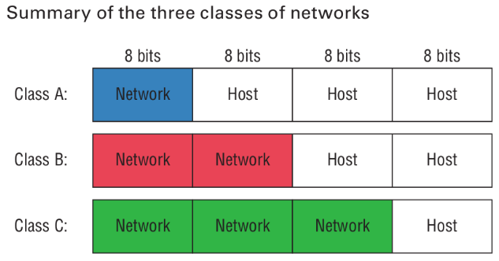
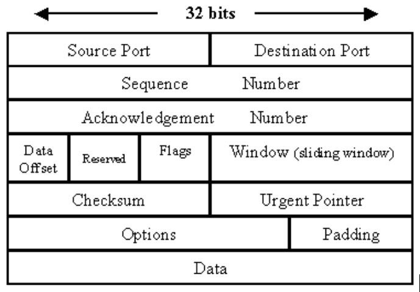

# IP Addresses, Packets, and Routing

## Ip Address
An IP address is a numeric identifier assigned to each machine on an IP network. It designates the 
specific location of a device on the network. IP addressing was designed to allow hosts on one 
network to communicate with a host on a different network regardless of the type of LANs the hosts 
are participating in. IP is the principal communications protocol in the Internet protocol suite 
(TCP/IP) for carrying packets (data) across networks. IP has the task of delivering packets from 
the source host to the destination host solely based on the IP addresses in the packet headers. 
The Internet Protocol was invented by Vint Cerf and Bob Kahn in 1974. The protocol was published 
in a paper titled "A Protocol for Packet Network Intercommunication" by the Institute of Electrical
and Electronics Engineers (IEEE).

There are two versions of the Internet Protocol; IPv4 and IPV6. An IPv4 address consists of 32 
bits of information, which are divided into four sections (called octets) each octet holding 8 
bits making 32 (8 × 4 = 32). An IP address can be written in 3 ways: 

* Dotted-decimal, as in 172.16.30.56
* Binary, as in 10101100.00010000.00011110.00111000
* Hexadecimal, as in AC.10.1E.38

IPv4 is known to be a structured, or hierarchical, address. The major advantage of this scheme is 
that it can handle a large number of addresses, (about 4.3 billion addresses). However, this 
structured scheme has an addressing disadvantage. If every address were unique, all routers on 
the Internet would need to store the address of each and every machine on the Internet. To solve 
this problem the solution is to use a two or three-level hierarchical addressing scheme organized 
by network and host or by network, subnet, and host. In this schema, Rather than all 32 bits 
being treated as a unique identifier, a part of the address is designated as the network address 
and the other part is designated as the host.

The network address uniquely identifies each network. Every machine on the same network shares 
that network address as part of its IP address. The host address is assigned to each machine 
on a network. This part of the address must be unique because it identifies a particular machine. 
The designers of the Internet decided to create classes of networks based on network size.

------------

### Class A
In a Class A network address, the first byte is assigned to the network address, and the three 
remaining bytes are used for the host addresses. The Class A format is as follows: 
* Network.host.host.host.  

For example, in the IP address 49.22.102.70, the 49 is the network address and 22.102.70 
is the host address.

### Class B
In a Class B network address, the first 2 bytes are assigned to the network address and the 
remaining 2 bytes are used for host addresses. The format is as follows: 

* Network.network.host.host 

For example, in the IP address 172.16.30.56, the network address is 172.16 and the host 
address is 30.56.

### Class C
The first 3 bytes of a Class C network address is dedicated to the network portion of the address, 
with only 1 measly byte remaining for the host address. Here’s the format: 

* network.network.network.host 

Using the example IP address 192.168.100.102, the network address is 192.168.100 and 
the host address is 102.

### Private vs Public IP Addresses
Because there is a limited number of IPv4 addresses, private ip addresses were invented. 
These addresses can be used on a private network, but they’re not routable through the Internet. 
This is designed for the purpose of creating a measure of much-needed security and to save 
valuable IP address space.

If every host on every network had to have real routable IP addresses, we would have
run out of available IP addresses to hand out years ago. But by using private IP addresses, 
ISPs, corporations, and home users need only a relatively tiny group of bona fide IP addresses 
to connect their networks to the Internet. This is economical because they can use private 
IP addresses on their inside networks and get along just fine. To accomplish this task, 
the ISP and the corporation need to use something called Network Address Translation (NAT), 
which basically takes a private IP address and converts it for use on the Internet.

-----
## Routing
Routing is the process of moving packets from one device in a given network to another device 
on another network using routers. Routers use routing protocols to determine where to route 
each packet. A routing protocol determines the path of a packet through an internetwork. 
Examples of routing protocols are Routing Information Protocol (RIP), Routing Information 
Protocol version 2 (RIPv2), Enhanced Interior Gateway Routing Protocol (EIGRP), and 
Open Shortest Path First (OSPF).
To be capable of routing packets, a router must know at least the following
information:

* Destination network address
* Neighbor routers from which it can learn about remote networks
* Possible routes to all remote networks
* The best route to each remote network
* How to maintain and verify routing information

The router learns about remote networks from neighbor routers or from an administrator. 
The router then builds a routing table (a map of the internetwork) that describes how 
to find the remote networks. If a network is directly connected, then the router already 
knows how to get to it. If a network isn’t directly connected to the router, the router 
must use one of two ways to learn how to get to it. One way is called static routing, 
which can be a ton of work because it requires someone to hand-type all network 
locations into the routing table. The other way is dynamic routing. In dynamic routing, 
a protocol on one router communicates with the same protocol running on neighbor routers. 
The routers then update each other about all the networks they know about and place this 
information into the routing table. If a change occurs in the network, the dynamic routing 
protocols automatically inform all routers about the event. If static routing is used, the 
administrator is responsible for updating all changes by hand into all routers.

## Packet
In computing, a packet is a formatted unit of data carried by a packet-switched network. 
A packet consists of control information and the payload.  The concept of packet switching 
and packages dates back to the 1960s. Packet switching divides data into small blocks - we 
call these blocks packages- and includes an identification of the intended recipient in each 
packet. Devices located throughout the network each have information about how to reach each 
possible destination. Basically, the internet is nothing but a web of packet-switching networks.

