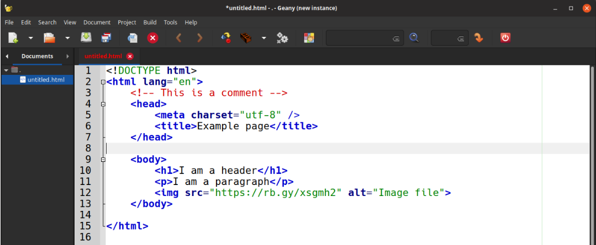
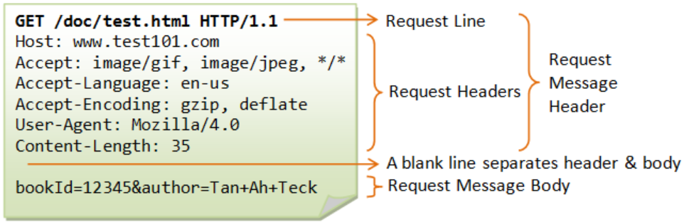

# Web Protocols and Other Technologies
## HTML and CSS
HyperText Markup Language (HTML) is a representation standard that specifies the syntax for a 
web page. Although HTML can be loosely defined as a way of writing documents, it allows developers 
to build complex pages that include graphics, tables, audio, and video. HTML only gives general 
guidelines for display text/multimedia and does not include detailed formatting instructions. 
This is the main reason why it is considered a markup language. The use of a markup language is 
important because it allows a browser to adapt the page to the underlying display hardware.  
To specify the markup, HTML uses tags embedded in the document. Tags provide structure for 
the document as well as formatting hints. An HTML document starts with the tag < HTML >, 
and ends with the tag </ HTML >. The pair of tags < HEAD > and </ HEAD > bracket the head, 
while the pair of tags < BODY > and </ BODY > bracket the body. In the head, the tags < TITLE > 
and </ TITLE > bracket the text that forms the document title.

Although HTML can be used to provide some style to the website, Cascading Style Sheets are 
the to-go technology to add style and modify the appearance of websites.  The name cascading 
comes from the specified priority scheme to determine which style rule applies if more than 
one rule matches a particular element.  The CSS specifications are maintained by the World Wide 
Web Consortium (W3C). In addition to HTML, other markup languages support the use of CSS including 
XHTML, plain XML, SVG, and XUL.

## W3C
The World Wide Web Consortium (W3C) is an international organization, lead by Tim Burners Lee, 
in charge of the standardization and organization for the World Wide Web. The W3C was founded 
in 1994 by Tim Burners Lee after he left the European Organization for Nuclear Research (CERN). 
The W3C is made up of member organizations that keep a full staff for developing standards. 
Alongside its main role, the W3C  develops software and serves as an open forum for discussion 
on the future of the Web. The W3C is extremely important for the proper interoperation of 
technologies on the web since vendors come up with different technologies and without a 
regulatory and standardization agency, the web would be nothing but a menage of broken technology.
An example is HTML which during the times of the Browser War saw many different changes 
implemented by different vendors (mainly Microsoft and Netscape). 

## HTTP and HTTPS
The HyperText Transfer Protocol (HTTP) is the primary transfer protocol that browsers use to 
interact with web servers. In essence, a browser is a client that extracts a server name from a 
URL and contacts the server. Most URLs contain an explicit protocol reference of http://, or 
omit the protocol altogether, in which case HTTP is assumed. Once it establishes a connection, 
a browser sends an HTTP request to the server. There are different types of requests. these 
are the major ones: GET, HEAD, POST, and PUT. GET Requests a document, HEAD Requests status 
information, POST sends data to a server and PUT also sends data to a server. The most common 
form of interaction begins when a browser requests a page from the server. The browser sends a 
GET request over the connection, and the server responds by sending a header, a blank line, and 
the requested document.

The first line (Request Line) includes the type of request, the time being requested, and 
the version of HTTP being used. The version is important because in the case where the server 
is running a higher version of the HTTP protocol, the server knows to send the response matching 
the requested version. This makes HTTP backward compatible with earlier versions. 

The first line of a response header contains a status code that tells the browser whether the 
server handled the request. There are different types of HTTP status codes depending on what the 
server responds. Some examples are:
 * 200: OK 
 * 201: Created 
 * 202: Accepted 
 * 301: Moved Permanently
 * 303: See Other
 * 304: Not Modified
 * 307: Temporary Redirect
 * 400: Bad Request
 * 401: Unauthorized
 * 403: Forbidden
 * 404: Not Found
 * 409: conflict
 * 410: Gone
 * 500: Internal Server error
 * 503: Service Unavailable

Hypertext Transfer Protocol Secure (HTTPS) is an extension of HTTP. In HTTPS, the communication 
protocol is encrypted using Transport Layer Security (TLS) or, formerly, Secure Sockets Layer 
(SSL). The protocol is therefore also referred to as HTTP over TLS, or HTTP over SSL. HTTPS has 
identical usage syntax to HTTP with the difference that HTTPS signals the browser to add an 
encryption layer over SSL/TLS.
